# FOUROVR Agency — Project Architecture & Graph Map

> This document provides a complete technical map and structural breakdown of the **FOUROVR Agency** web application. Any AI agent or developer reading this file can instantly understand the codebase architecture, routing, component hierarchy, and design system.

---

## 🚀 Tech Stack & Core Libraries

- **Framework**: React 18 (Vite Bundler)
- **Routing**: `react-router-dom` (v6+)
- **Styling**: Vanilla CSS with Design System Tokens, Glassmorphism, and HSL Dark Modes
- **Icons**: `lucide-react`
- **Animations**: `framer-motion` + Custom CSS Keyframe Animations
- **AI Chat Widget**: Embedded `AIChatWidget` (Nova AI Advisor)

---

## 📊 Application Architecture Graph

```mermaid
graph TD
    classDef core fill:#0a0b0a,stroke:#c7ff24,stroke-width:2px,color:#f4f4f5;
    classDef layout fill:#1a1c1a,stroke:#a78bfa,stroke-width:1px,color:#f4f4f5;
    classDef page fill:#131513,stroke:#38bdf8,stroke-width:1px,color:#f4f4f5;
    classDef homeComp fill:#1c1e1c,stroke:#ff6b9d,stroke-width:1px,color:#f4f4f5;

    App["src/App.jsx (Router Base)"]:::core

    subgraph Shell & Global Utilities
        Navbar["Navbar.jsx (with Services Mega Menu)"]:::layout
        Footer["Footer.jsx"]:::layout
        AIChat["AIChatWidget.jsx (Nova AI Advisor)"]:::layout
        Cursor["CustomCursor.jsx"]:::layout
        Preloader["Preloader.jsx"]:::layout
        Scroll["ScrollToTop.jsx"]:::layout
        Glow["PageHeaderGlow.jsx"]:::layout
        Marquee["MarqueeBar.jsx"]:::layout
    end

    subgraph Main Page Routes
        Home["/ → HomePage.jsx"]:::page
        Work["/work → WorkPage.jsx"]:::page
        Services["/services → ServicesPage.jsx"]:::page
        Pricing["/pricing → PricingPage.jsx"]:::page
        About["/about → AboutPage.jsx"]:::page
        Contact["/contact → ContactPage.jsx"]:::page
        AIAssistant["/ai-assistant → AIAssistantPage.jsx"]:::page
    end

    subgraph Sub-Service Dedicated Pages
        WebDev["/services/web-development → WebDevServicePage.jsx"]:::page
        GraphicDesign["/services/graphic-design → GraphicDesignServicePage.jsx"]:::page
        Marketing["/services/marketing → MarketingServicePage.jsx"]:::page
        AIAutomation["/services/ai-automation → AIAutomationServicePage.jsx"]:::page
    end

    subgraph Homepage Sections Breakdown
        HeroComp["Hero.jsx"]:::homeComp
        LogosComp["ClientLogos.jsx"]:::homeComp
        WhatWeDoComp["WhatWeDo.jsx"]:::homeComp
        ApproachComp["ApproachSection.jsx"]:::homeComp
        CollideComp["CollideSection.jsx"]:::homeComp
        PricingComp["PricingSection.jsx"]:::homeComp
        TestimonialsComp["TestimonialSection.jsx"]:::homeComp
        CTAComp["CallToActionSection.jsx"]:::homeComp
    end

    App --> Navbar
    App --> Footer
    App --> AIChat
    App --> Cursor
    App --> Preloader
    App --> Scroll
    App --> Glow
    App --> Marquee

    App --> Home
    App --> Work
    App --> Services
    App --> Pricing
    App --> About
    App --> Contact
    App --> AIAssistant

    App --> WebDev
    App --> GraphicDesign
    App --> Marketing
    App --> AIAutomation

    Navbar -- "Hover Trigger" --> MegaMenu["Mega Menu Popup (4 Partitions)"]
    MegaMenu --> CreativePart["🎨 Creative (Brand, UI/UX, Motion, Photography)"]
    MegaMenu --> DevPart["💻 Development (Web, Mobile, E-Com, Desktop)"]
    MegaMenu --> AutoPart["⚡ Automations (AI Agents, Workflows, Pipelines)"]
    MegaMenu --> MktPart["📣 Marketing (Social, SEO, Email, Paid Ads)"]

    Home --> HeroComp
    Home --> LogosComp
    Home --> WhatWeDoComp
    Home --> ApproachComp
    Home --> CollideComp
    Home --> PricingComp
    Home --> TestimonialsComp
    Home --> CTAComp
```



---

## 📁 Directory Structure & File Map

```
fourovr-agency/
├── index.html                  # Main HTML Entry point
├── vite.config.js              # Vite configuration
├── package.json                # Project dependencies
├── ARCHITECTURE.md             # Architecture & Codebase Map (This file)
├── src/
│   ├── main.jsx                # React DOM render entry point
│   ├── App.jsx                 # Main Router & layout wrapper
│   ├── index.css               # Global CSS tokens, theme variables & utilities
│   ├── App.css                 # Base app styles
│   ├── assets/                 # Brand logos and images
│   ├── components/             # Reusable & Layout Components
│   │   ├── Navbar.jsx          # Floating pill navbar + Services Mega Menu
│   │   ├── Navbar.css          # Mega menu styles & animations
│   │   ├── Hero.jsx            # Interactive Mouse Spotlight Hero Section
│   │   ├── Hero.css            # Responsive Hero typography & layout rules
│   │   ├── Footer.jsx          # Agency Footer with brand info & links
│   │   ├── Footer.css          # Footer styles
│   │   ├── AIChatWidget.jsx    # Nova AI Assistant Widget
│   │   ├── AIChatWidget.css    # AI Chat overlay styles
│   │   ├── Services.jsx        # Services grid section
│   │   ├── PricingSection.jsx  # Interactive packages & pricing tiers
│   │   ├── ClientLogos.jsx     # Brand trust ticker
│   │   ├── ApproachSection.jsx # Workflow & methodology section
│   │   ├── CollideSection.jsx  # Interactive feature highlight
│   │   ├── TestimonialSection.jsx # Client reviews & ratings
│   │   ├── CallToActionSection.jsx # Conversion banner section
│   │   ├── CustomCursor.jsx    # Custom animated cursor
│   │   ├── Preloader.jsx       # Initial site loading screen
│   │   ├── ScrollToTop.jsx     # Route change scroll reset handler
│   │   ├── PageHeaderGlow.jsx  # Ambient background top glow effect
│   │   └── MarqueeBar.jsx      # Infinite scrolling ticker text
│   └── pages/                  # Page Route Views
│       ├── HomePage.jsx        # Landing page
│       ├── WorkPage.jsx        # Portfolio & Case Studies
│       ├── ServicesPage.jsx    # All Services overview page
│       ├── PricingPage.jsx     # Comprehensive pricing table
│       ├── AboutPage.jsx       # Agency story & team
│       ├── ContactPage.jsx     # Contact form & booking
│       ├── AIAssistantPage.jsx # Dedicated Nova AI page
│       ├── WebDevServicePage.jsx # Service detail: Web Development
│       ├── GraphicDesignServicePage.jsx # Service detail: Creative Design
│       ├── MarketingServicePage.jsx # Service detail: Growth Marketing
│       └── AIAutomationServicePage.jsx # Service detail: AI & Automation
```

---

## 🎨 Design System Tokens (`index.css`)

```css
:root {
  --color-ink: #0a0b0a;          /* Deep Dark Background */
  --color-lime: #c7ff24;         /* Primary Accent Brand Lime */
  --color-lime-bright: #d4ff57;  /* Bright Lime Hover State */
  --color-paper: #f4f4f5;        /* Primary Text */
  --color-paper-muted: #a1a1aa;  /* Muted Subtitles & Labels */
  --color-border: rgba(255, 255, 255, 0.1);
  --color-surface: rgba(255, 255, 255, 0.03);
  
  --font-sans: 'Inter', sans-serif;
  --font-display: 'Plus Jakarta Sans', 'Outfit', sans-serif;
}
```

---

## 🌟 Key Navigation Feature: Services Mega Menu

The `Navbar.jsx` component implements an interactive floating **Mega Menu** for the **Services** link:

### Partitions & Data Matrix (`megaMenuData`):
1. **🎨 Creative (`#ff6b9d`)**: Brand Identity, UI/UX Design, Motion & 3D, Photography
2. **💻 Development (`#c7ff24`)**: Web Development, Mobile Apps, E-Commerce, Desktop Apps
3. **⚡ Automations (`#a78bfa`)**: AI Agents, Workflow Automation, Data Pipelines, AI Integration
4. **📣 Marketing (`#38bdf8`)**: Social Media, SEO & Growth, Email Campaigns, Paid Ads

---

## ⚙️ Development Commands

```bash
# Start local development server
npm run dev

# Production build
npm run build

# Preview production build locally
npm run preview
```
